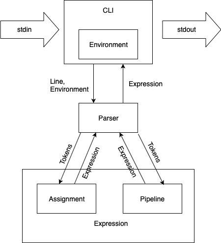

# Architecture

Architecture of CLI consists of four main components:

## Components

**Environment**

Environment is an object that stores information about existing internal commands and variables.

While interacting with CLI environment you may add new variables or update existing ones.

**Parser**

Parser is a special class that provides possibility to parse commands that you pass to the CLI.

Its main goal is to represent input in some convenient way and to tell you if some syntax error was made.

Parser uses the environment to make variable substitution.

**Expression**

Expression is a shell over all parsable commands. It corresponds either to the assignment or to the pipeline.

**Command**

Command is a basic class that provides interface for all executable commands, both implemented and not
implemented in CLI. Multiple commands may be organized into a pipeline.

All commands in this CLI implementation have the only public function `execute`, so we may think about every
implemented command as of something that takes arguments, reads data from the standard input and writes data to the
standard output.

Information about all supported internal commands may be found in README.

## Component interaction

Described components interact in the following way.

In the infinite loop command line interpreter reads data from the standard input and passes it to the
`CommandLineInterpreter` class.

Inside it data is parsed with Parser basing on the predefined Environment, and if the parsing process succeeded we get
an executable Expression which is a shell over Pipeline and Assignment.

In case an expression corresponds to assignment, its execution just add variable to the environment.

In another case (i.t. an expression corresponds to the pipeline), program moves through all commands in the pipeline, execute
them and pass their output either to the next commands, or to the standard output if no commands left.

## Class diagram

